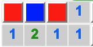
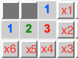
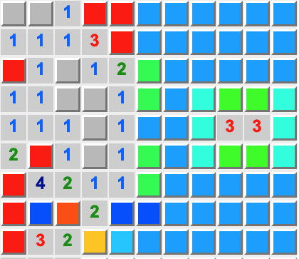

# Another/(The same as others) Minesweeper Solver

Resolving my urge of playing minesweeper for once and for all.

## How to run
```bash
python -m venv venv    
source venv/bin/activate
python -m pip install -r requirements.txt
python app.py
```

or if you want to compile ts code and run it
```bash
tsc && python app.py 
```

## Solver short description

#### Apply "basic strategy"
  
Basic strategy consist of three steps:
1 check if number-cell already fulfils mine condition, if thats the case, then all neighbouring cells are 100% not mines
2 if it fails mine condition, then check how many free cells are there in the neighbourhood, if number of such cells is equal to a number of missing mines, then all neighbouring cells are 100% mines
3 Repeat until no more cells can be solved

Example:
<p align="center">
  
</p>

- First we discover that mine is in the bottom left corner (Step 2)
- then based on second "1" determine that middle cell must be empty (Step 1)
- lastly right cell must be mine to satisfy first "1" and "2" (Step 2)


This strategy is simple, fast and effective. If you are lucky is already enough to solve the small board.

#### Solve system of linear equations

For the rest we need to solve system of equations for each perimeter separately. System of equations is constructed in a way that matrix A represents if number cell is adjacent to a mine, x is a vector of all unknown cells where mine can be present, b is a vector of all number cells, f is a vector of all flags and known mines adjacent to number cells.

Formally: $A x = b - f$ where $x \in \{0, 1\}$

<table align="center">
<tr>
<td valign="left"></td>
<td valign="center"> 

$$

\begin{pmatrix}
1 & 1 &0 & 0 & 0 & 0 \\
1 & 1 & 1 & 1 & 1 & 0 \\
0 & 0 & 0 & 1 & 1 & 1 \\
0 & 0 & 0 & 0 & 1 & 1
\end{pmatrix}
\begin{bmatrix}
x_1 \\
x_2 \\
x_3 \\
x_4 \\
x_5 \\
x_6
\end{bmatrix}
=
\begin{bmatrix}
1 \\
3 \\
2 \\
1
\end{bmatrix}
$$

</td>
</tr>
</table>


Unfortunately, matrix $A$ most of the time is underconstrained, meaning there are more unknowns than equations. So there is no other way than to brute force all possible solutions. Since $x$ is binary (either there is mine or not), we can use backtracking to find all possible solutions. Complexity is not great ($2^n$), and it could get very slow for large boards. Hence we need to use some tricks to speed it up.
- Apply basic strategy first to reduce number of unknowns
- Simplify the system of equations by converting it to Echelon form by Gaussian elimination. This would remove some of the equations that are redundant and would reduce number of unknowns. For example above, row echelon form would be:

$$

\begin{pmatrix}
1 & 1 &0 & 0 & 0 & 0 \\
0 & 0 & 1 & 1 & 1 & 0 \\
0 & 0 & 0 & 1 & 1 & 1 \\
0 & 0 & 0 & 0 & 1 & 1
\end{pmatrix}X=
\begin{pmatrix}
1 \\
2 \\
2 \\
1
\end{pmatrix}
$$

and general solution is:

$$

X=\begin{pmatrix}
1-x_2 \\
x_2 \\
x_6 \\
1 \\
1-x_6 \\
x_6
\end{pmatrix}
$$

So  we only need to check for solutions where $x_2$ and $x_6$ are either 0 or 1, and other variables (x1, x3, x4, x5) are calculated from them.


Once set of solutions is found, we need to check if they are consistent with each other. Go through each solution and find index for which all solutions are consistent (all solutions have 1 or 0 in that index). Map index to cell location and mark it as 100% mine or 100% empty.

#### Probability 

For each other cells we can calculate probability of mine being in that cell based on how many possible arrangements are possible for a given board state. 

Example of Probability map - red cells are mines, blue cells are empty everything in between is probability of mine being in that cell (light green is 50-50)
<p align="center">
  
</p>

The right perimeter can have solutions with 3 to 6 mines, we need to evaluate each option and calculate number of arrangements. So in this example there are 37 detached cells (not part of any perimeter) and lets say number of undiscovered mines is 15. So for solutions that have 3 mines they have possible of $nCr(37, 15-3)$ arrangements, for 4 mines $nCr(37, 15-4)$ and so on. Go through each solution and location where mine can be present and add number of arrangements to the cell - final probability is the count for the cell divided by total number of arrangements for all solutions. If multiple perimeters are involved, then we need to consider **combinations** of solutions.